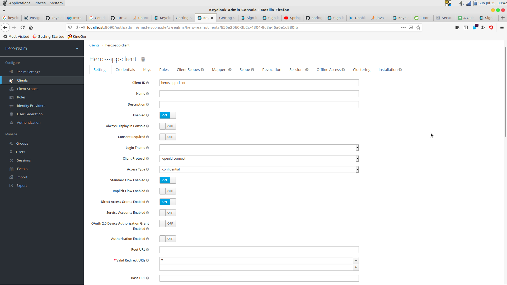

# Oauth2 and Exception Handling

## Setup
1. Start the docker env  

        docker-compose -f docker/docker-compose.yml up -d

2. Setup Keycloak and adapt the secret in the `application.properties` file ([keycloak guide](https://www.keycloak.org/docs/latest/getting_started/index.html#creating-a-realm-and-a-user))

    

3. Start spring boot app  

        ./mvnw spring-boot:run

4. Login http://localhost:8080

5. swagger-ui http://localhost:8080/swagger-ui.html

---

## Tests

- UnitTests  

        ./mvnw clean test
        
- IntegrationTests  

        ./mvnw clean verify
        